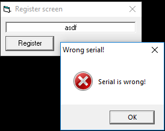
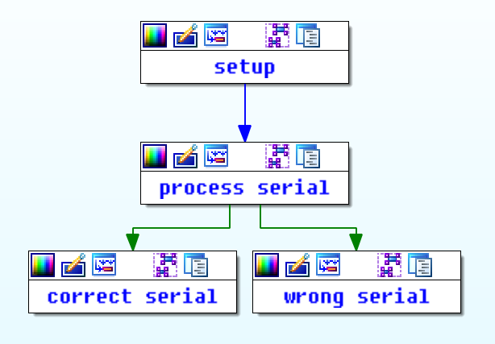
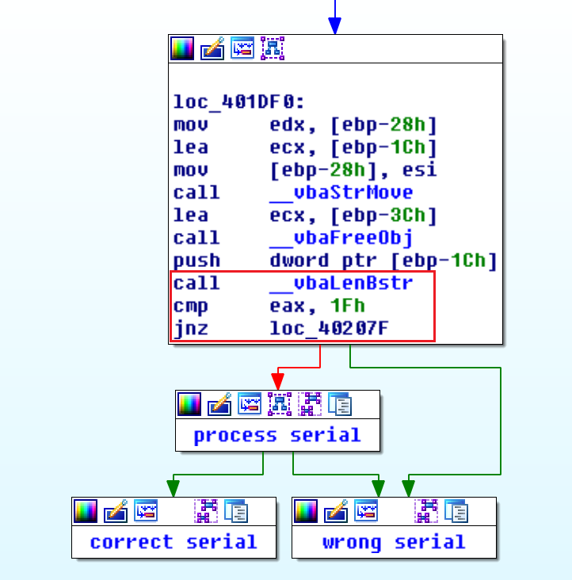
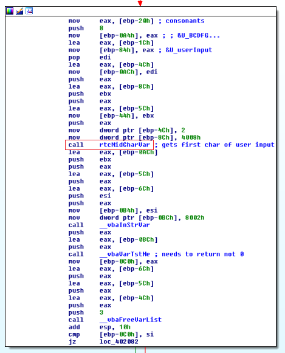
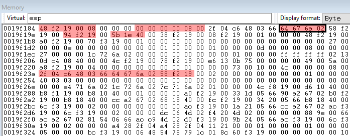
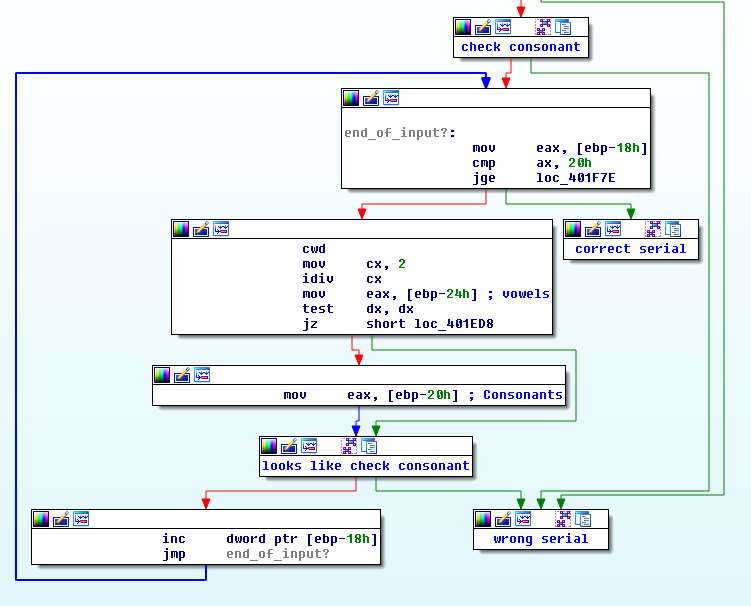

# Reverse Engineering a VBA Crackme

This time, we will go over the process that I used to solve [this Crackme](keygenme.exe) that I using IDA Pro and WinDbg.

## What is a Crackme?

A Crackme is an exercise for reverse engineering that imitates the process of cracking software product keys. An attacker is supposed to learn the algorithm used by the software to verify a serial number so that they can create an input that is a valid serial key. A Keygenme is a special type of Crackme where an attacker is to create a program (called a keygen) that generates the serial key for the challenge.

## The Challenge

[The challenge zip](Keygen_me.zip) contains three files: the challenge binary, a keygen for the binary, and some rules for the challenge. The rules for the challenge goes as follows:

> keygenme.exe is a "real" keygenme, becourse it checks that if the serial is created by the real algorythm. It is very easy, after this i make a harder one. Hope you like it.
> 1. No patching
> 2. No bruting
> 3. Just make a keygen
> I made my own keygen there, it is protected by password, but when you get the algorythm, you should guess the pass.

These rules are pretty standard, we just need to write a keygen for this program.

## The Program

This application is pretty simple. The user gets a dialog box that requests the key from the user. If an invalid key is entered, a new dialog box is spawned saying that the serial is incorrect.




## Analysis

We begin our analysis by opening the binary in IDA Pro. Instead of diving directly into the code, we can look at the strings in the binary to get an idea of what is going on.


This list of strings tell us a couple important things along with give us a place to begin our analysis of the disassembly. First, we can see a bunch of strings that look like function names that begin with vba. This probably means that the binary was written with Visual Basic. If you know Visual Basic, you might have more intuition later on while you read the code. I do not know Visual Basic but at least I now have an extra keyword to add to my Google searches. There are also two strings, one with vowels and another with consonants. Maybe these two things have something to do with the structure of the serial key. We also see the string "Right Serial" in this dialog. We can now use IDA to find the code that references this string and work backwards to find the logic that gets us to it. 

### Disassembly

Once we follow the xref to the string "Right Serial!" we are able to see the entire function that is responsible for validating the user input. There is too much code to attach a screenshot. This may be a little overwhelming, but we can look at this function in little pieces to keep our sanity. We start by grouping nodes together based on the type of stuff that it looks like it is doing. At the highest level, it appears that there is some code at the beginning for setting up, some processing code, then logic that handles when the user input is valid or invalid. We can make a pretty good guess at how to group these based on strings accessed, functions called and general structure of the code. It is not too important to be correct the first time since the IDA is just a tool to help you structure your current understanding of an application. Grouping can change later as you get a better understanding.



Now that we have an idea of how the binary works at a high level, we can start to dive in deeper to how the string is actually processed. We can now look at the first basic block in serial processing logic. 

#### Input Length



At the end of this basic block, we see that there is a call to the function `__vbaLenBstr`, a comparison of `$eax`, and a jump based on the result. Given the name of the function, we can assume that this probably branches based on the length of user input. If it is 31 characters long (`0x1f`), then it will go to the the rest of the processing. Otherwise, it will go to the incorrect serial logic. To test our theory, we open the application in WinDbg, set a break point after the function call, and run it with multiple inputs of different lengths. After a few runs, it is obvious that our hypothesis was correct.

At this point, we know that user input has to be 31 characters long in order to be a valid serial.

#### Understanding rtcMidCharVar

The first basic block after the length check has a decent bit of code in it. To try to understand this code, we can look at the functions that are called and get some idea that we can test in a debugger. The first call in this function is `call rtcMidCharVar`. Since I do not know VBA, I do not have any intuition about what this function does. To figure that out, we can do some googling, but I was unsuccessful in finding anything useful



To figure this out for ourselves, we can look at what gets passed into the function what gets returned. After a bit of debugging, I was unable to figure out the calling conventions used by this application. So instead I noted and labeled some instructions based on what data they were accessing. With a good view of how the stack is layed out, we can understand future memory accesses easily.

To figure out what this mysterious `call rtcMidCharVar` does, I ended up opening a large window of the stack in a hex editor, stepping over the function call, then seeing what changed.



In the image above, red bytes were changed in the call to `rtcMidCharVar`. Only one of the changed values seemed useful. The boxed value `0x026a6764` (little endian) is a pointer to a string containing the first character in the user input. At this point, we can assume that this function extracts a character from a given string.

#### Understanding \_\_vbaInStrVar

This function is much easier to understand. With a quick Google search, we can determine that this function is likely what the [VBA function InStr](http://www.excelfunctions.net/vba-instr-function.html) compiles into. With our understanding of how `rtcMidCharVar` works, along with noticing that a string containing all the consonants is referenced at the top of the basic block, it looks like this call along with the `__vbaVarTstNe` checks to see if the first character is a consonant. We verify that this understanding is correct by debugging.

Here, we can now say that this block of code checks that the first character of the user input is a consonant.

#### Reading and Assembly

Scrolling down a little bit in the IDA graph view, we see a couple small blocks that change the value of `$eax` followed by a large block that looks a lot like the one that we reverse engineered in the previous sections. 



Since this code is fairly simple, we can understand what is going on just by reading it. The top block will branch to the correct serial logic once we have examined all of the user's input. The next two blocks will set `$eax` to either the vowel or consonant string depending on the index of the character that we are looking at. Those two blocks can be described by the following pseudocode:

```C
if (index % 2 == 0)
  eax = &vowels
else
  eax = &consonants
```

The block at the bottom just increments a value (probably the index of the user input) and loops back to the top.

After all of the analysis thus far, we can say that a valid serial key consists of alternating consonants and vowels. Now that we understand the algorithm, we are ready to write a keygen.


### Writing the Keygen

This keygen is fairly simple. A key is constructed by alternating the concatenation of a random consonant or vowel to the current key. It is then printed to the console:

<strong>keygen.py</strong>
```python
#!/usr/bin/env python

import random

vowels = "AEIOUY"
consonants = "BCDFGHJKLMNPQRSTVWXZ"

def generate_key():
  answer = ""

  for k in range(31):
    if k % 2 == 0:
      answer += random.choice(consonants)
    else:
      answer += random.choice(vowels)

  return answer

while True:
  raw_input("Press enter to generate key...")
  print(generate_key())


```


## Tips for Reverse Engineering

* Look at strings in the binary
  * Strings in a binary can give you a really good idea of where to begin looking

* Label everything and keep notes
  * You will save a lot of time that would be spent reversing engineering code that you already have good notes and labels

* Try to read a little assembly as possible. 
  * Reading and understanding assembly is much more time consuming then looking at strings and function names and verifying in a debugger

